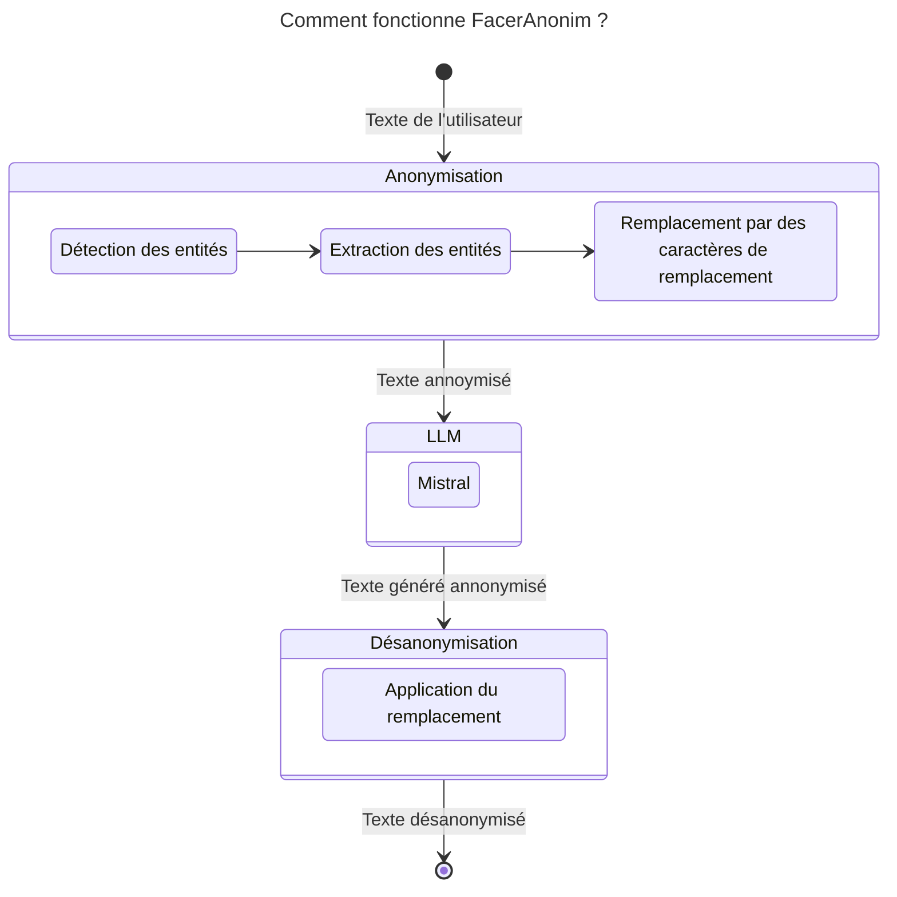

# FacerAnonim 
Projet d'anonymisation de texte avec envoie à un LLM

## Description
Ce projet permet d'anonymiser des entités nommées (personnes, organisations, lieux, etc.) dans un texte en remplaçant les mots identifiés par des identifiants uniques et cohérents. Il est utile pour masquer des informations sensibles tout en conservant la structure et la lisibilité du texte.

## Fonctionnalités

- Extraction et anonymisation des entités nommées
- Remplacement des entités par des identifiants uniques et cohérents
- Génération d'un dictionnaire des correspondances entre entités et identifiants

⚠️ **IMPORTANT :**
Le projet ne prend en charge que la langue française pour le moment.**  
**Cette fonctionnalité est en cours de développement (WIP) et pourrait être étendue à d'autres langues dans le futur.

## Installation
### Prérequis
- Python 3.x
- Bibliothèques requises :

```python 
pip install -r requirements.txt
```
## Fonctionnement


## Utilisation
### Exemple de code
```python 
from anonymization import EntityAnonymizer
from mistralai import Mistral

client= Mistral(api_key=os.environ["API_KEY_MISTRAL"])

anonymizer = EntityAnonymizer()
anonymized_text = anonymizer.anonymizer("Le Crédit Mutuel Arkéa est une banque Française")

response = client.chat.complete(
            model = "mistral-large-latest",
            messages = [
                {
                    "role": "user",
                    "content": anonymized_text,
                },
            ]
        )

response = anonymizer.deanonymizer(response.choices[0].message.content)
```
<!--
### Prise en charge des modèles LLM

Ce projet prend actuellement en charge les modèles suivants :

- **Mistral** (via l'API Mistral)

Vous pouvez configurer le modèle souhaité lors de l'initialisation du handler LLM. Exemple :

```python
llm_handler = LLMHandler(provider="mistral", api_key=os.environ["API_KEY_MISTRAL"])
```
-->

## Tests


Les tests unitaires sont disponibles dans test.py. Pour les exécuter :
```python 
pytest tests/test_entity_anonymizer.py
```
